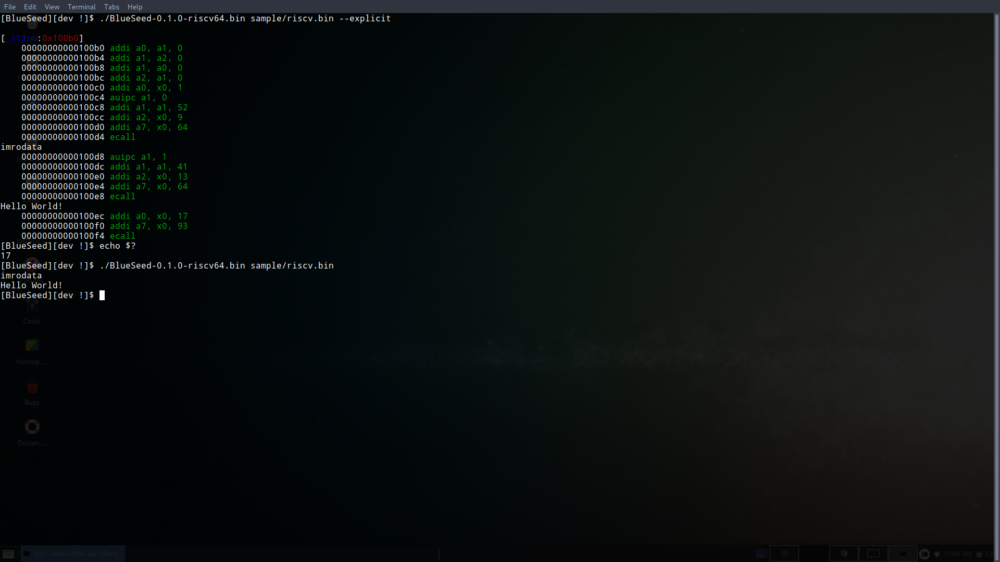
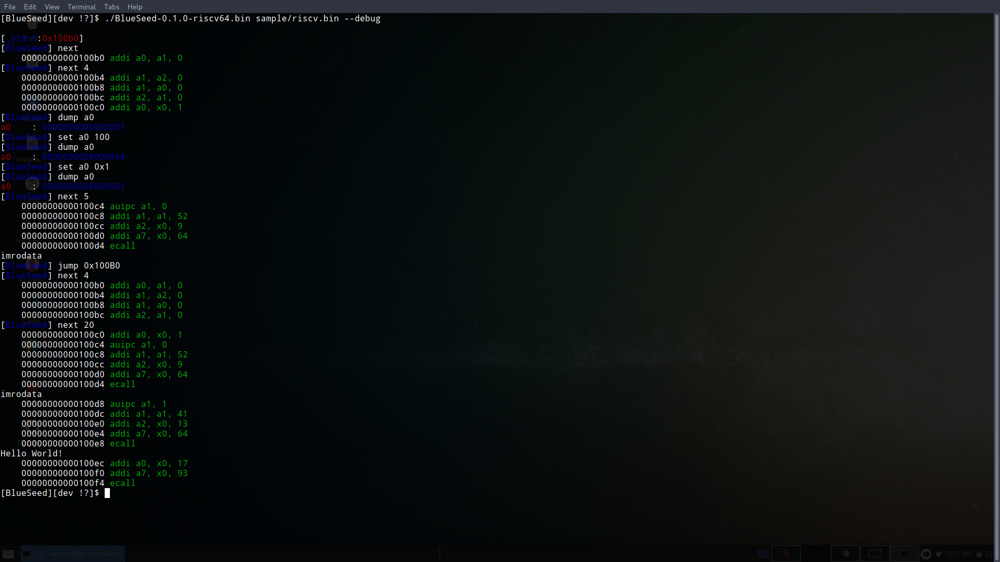

# BlueSeed Documentation

BlueSeed is a little project without ambition that explore the world of RISC-V.

This Documentation is short and write with MarkDown syntax for a better integration.

## RISC-V A blurry world

[RISC-V](https://riscv.org) is an open source hardware [ISA](https://en.wikipedia.org/wiki/Instruction_set_architecture) (Instruction Set Architecture) type [RISC](https://en.wikipedia.org/wiki/Reduced_instruction_set_computer) (Reduce Instruction Set Computer).

This ISA is not much used to date but has potential to exploit.

The problem is that, there is a lot of lacks in tools used for RISC-V developpement.

Advanced in this world is so complicated and there are few information and precedent on the subject.

By the way, we will try for the best.

## BlueSeed

BlueSeed is a cross-plateform RISC-V(32/64) emulator wroten in C (and a well hidden assembly file).

### Prologue

The goal is not to build a complete emulator but only explore this world.

BlueSeed does NOT handle all Instruction Set and the emulation environnement is clearly basic.

### Install

The project can be built for a lot of plateform thanks to his toolchain builder which allows cross-compiling.

`./mktoolchain/mktoolchain $TARGET`

Where TARGET is the host machine architecture which will run BlueSeed.

If no toolchain TARGET is given then defaulting to the host machine.

### Build

The idea is that the TARGET architecture to emulate is selected in compile-time.
The repository architecture is made to easily accommodate new architectures if needed (scalability).

`make TARGET=$TARGET`

Where TARGET is (riscv32 | riscv64) the target to emulate.

So, your build define the target to emulate, if you want emulate an another you must re-build.

### Run

`./BlueSeedXXX $BINARY [...options]`

Options list:
  * --verbose   : display information during environnement init

  * --explicit  : display the current executed instruction

  * --debug`    : debug environnement (CLI), "help" for help

### About

The system calls are interfaced with the host machine, there is no self emulator interface. 
Software interrupts are interfaced only for x86, x64 and ARM host machine.
Their are Generating during the build for the particular host machine.

BlueSeed handle only the [ELF](https://refspecs.linuxbase.org/elf/elf.pdf) binary format.

The handled instruction set are:
  * rv32i (standard Instruction Set)
  * rv64i (standard Instruction Set)
  * compressed (32/64)

The ELF loader is very basic and does not allow dynamic linkage with shared object, etc...
Unfortunately GCC needs this to work.

BlueSeed own a basic runtime debugger.
You can get/set registers values and jump over address in the program.

## Epilogue

As an emulator, BlueSeed is very (really) permissive, keep that in mind.

Take time to read the [RISC-V official specification](https://content.riscv.org/wp-content/uploads/2019/06/riscv-spec.pdf), and there was light.

Feel free to fork, use, improve.
